Linux is an operating system that could be used with only a mouse and a keyboard. In order to make it easier for you guys to configure linux and python, I have summarized some tips of my previous month's installation experience and shared it with you guys.

(Ps: I am using ubuntu 18.10, ubuntu 18.04lts and ubuntu 16.04 are also ok but slightly different)

### Why Linux

Summarized into keywords: fast, convenient, safe, powerful

For my old computer a few years ago, installing Linux is a better choice. I started to learn some basic operations by installing a virtual machine. After that, I began to install dual system. Linux is not only small and convenient but also open-source. installing Linux is a very good choice for most computers.

The reason why Linux is suitable for old computers is that it has a smaller occupation of the system. Computers using Windows are basically as slow as ox carts after being used for six or seven years, whereas the amazing operating system Linux may not change much after using ten to twenty years. According to our school's English teacher, his father originally installed Linux on his old computer and found it to be particularly fast (he installed Xubuntu, an operating system specifically for old computers).

Having said so much, in fact, the most important reason: it is **free**!

### VMware Installation tutorial：

1,Download

url: https://www.ubuntu.com/download/desktop

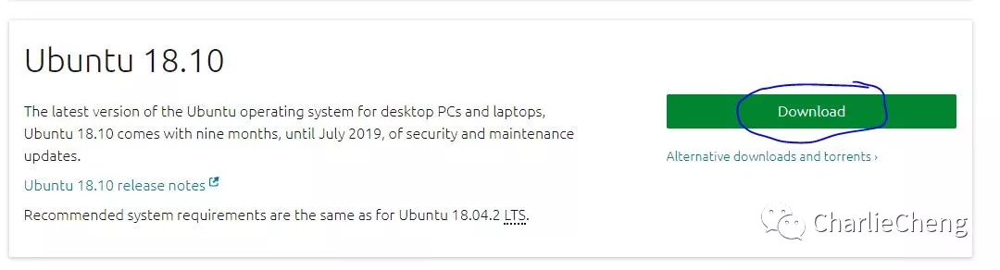

it will be an iso file，so first we need to save our computer.

2，configuration

Create a New Virtual Machine in VMware.

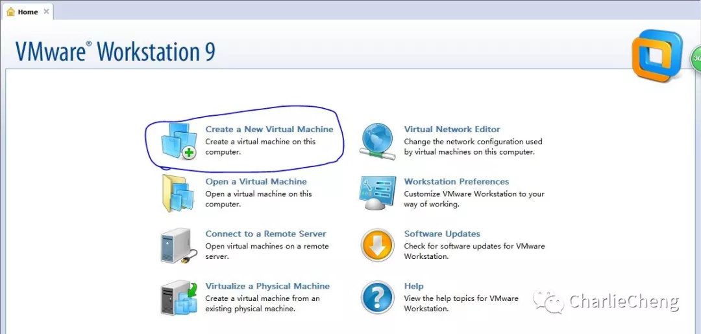

Then it will pop up the installation interface. ("Typical" is enough for most cases, here I chose "Custom" for more configuration).

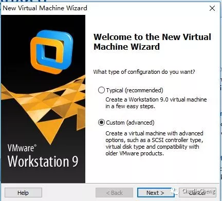

Click Next.

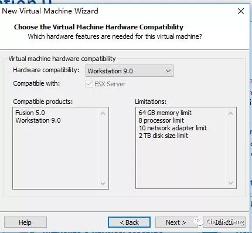

Here we need to choose the iso file we previously downloaded. 

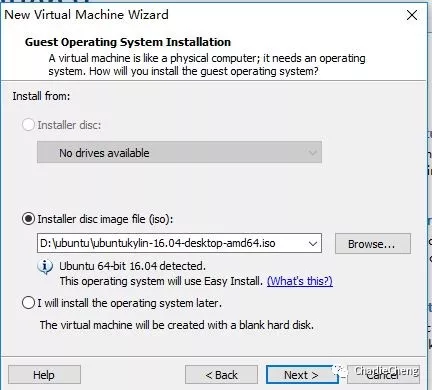

Enter the Name and the password. 

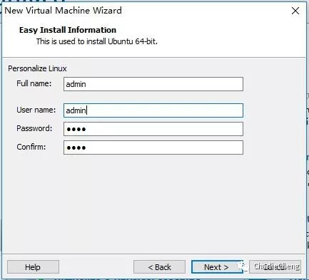

Choose the installation location (try to find a larger space)

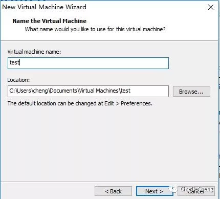

The number of processors is depended on use. For testing out, 1 is enough. 

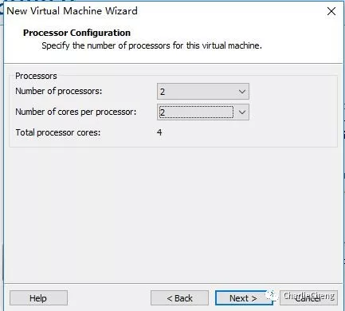

Memory. Still based on needs.

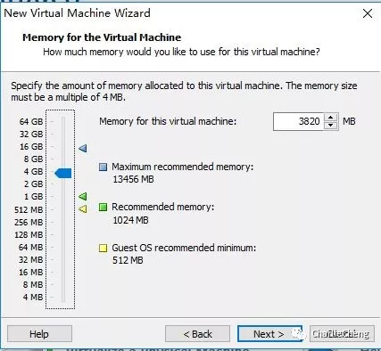

Here we need to choose network connection. I chose bridged networking for  using ssh to connect.

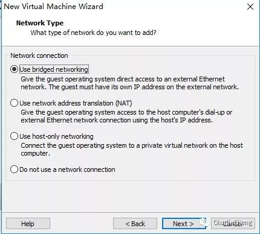

Keep clicking "Next".

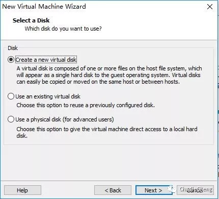

Configurating disk size. Strongly recommend to configure a larger space. （Be cautious! We can only enlarge the space but not decrease in the future）

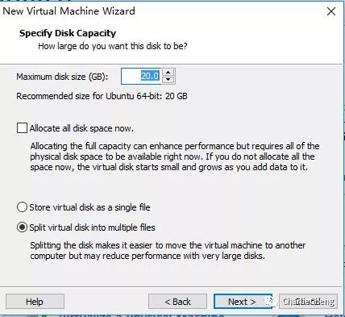

Keep clicking next until seeing this. Double check our configuration.

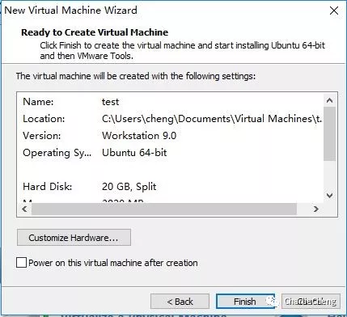

After several minutes, your Linux machine is done!

Installing Dual system: 

1，Download the iso file

2，prepare an empty USB drive (Please make sure it is empty)

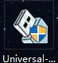

Download universal-USB-installer on google. Run it.

*Many installers are not compatible with ubuntu. Universal-USB-installer is 100% compatible with ubuntu. 

(I recommend to close all the anti virus programs)


Click agree.

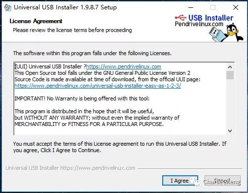

step1, choose your system (ubuntu).

step2, choose your iso file

step3, choose your empty USB driver.

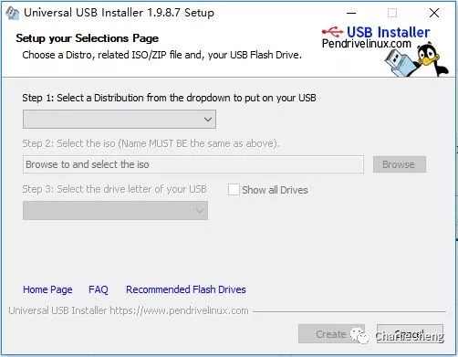

It will be done after clicking "create".

Then we need to download EasyBCD.

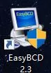

Just install it at the moment. We need to use it later.

Now restart our computer and press f12 to access to BIOS (Different computers have different ways to access BIOS. You can check it out on Google)

Choose "Boot from USB".

(Keep clicking next, and set up your username and password)

#Here we need to notice that there should be a boot section (Around 1GB), A swap section(I chose 5 GB), home section (based on need).

Restart After Installing.

Open EasyBCD.

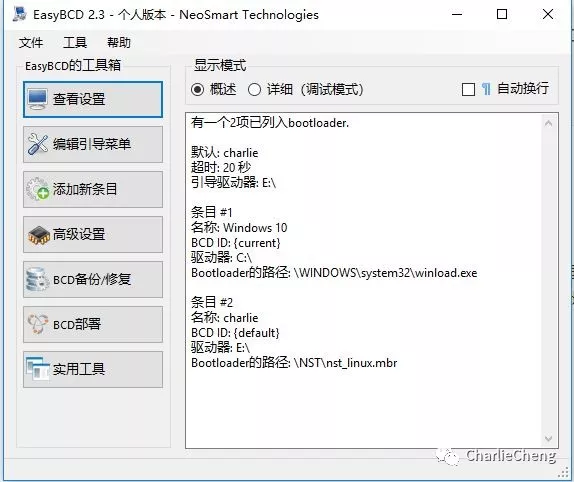

Add a new config

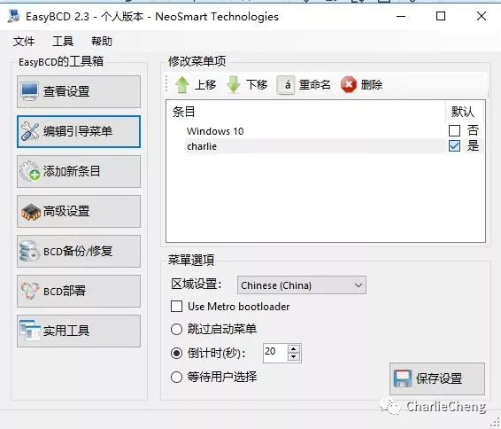

Do not change the first row. The second row is for changing names.

Choose your boot section in the third row.

Add a new config, click "yes" after Linux.


Save, Restart, and Enjoy!


Then for connecting with ssh

We need to download some apps to 

You can use MobaXterm, Putty, Xshell, etc.

I chose MobaXterm as an example.

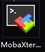

Select new session.

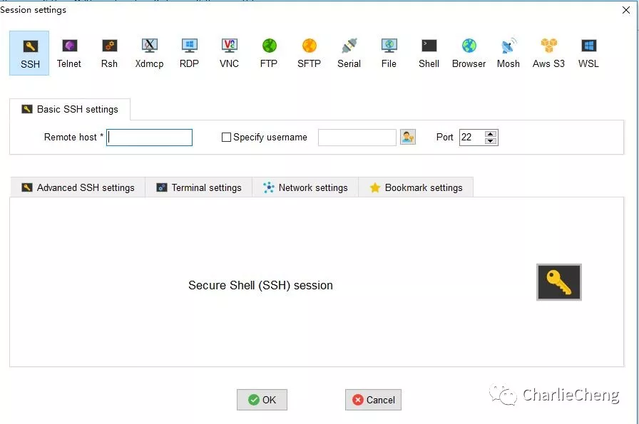

type in your IP address. (You can check by typing ipconfig)

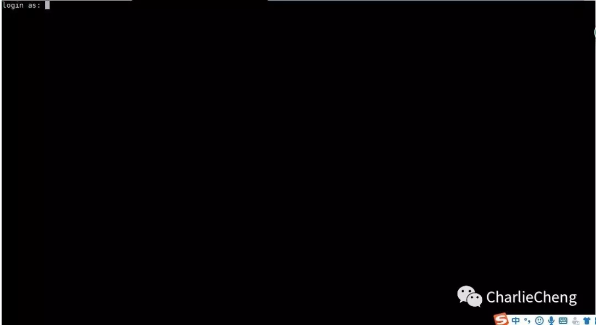

Here we need to type in Username and Password.


##### Now it is time to configurate Python!

In fact Linux has many pre-installed apps, which is enough for daily use.

type ctrl+alt+T to access the terminal. 

Type "python" to see your version.

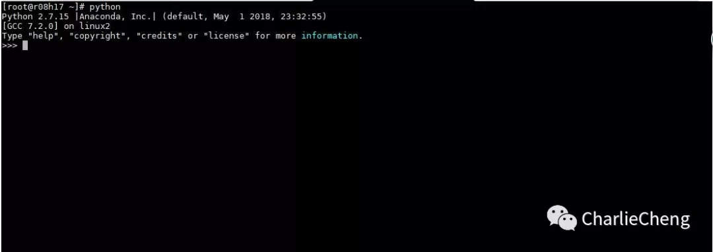

Now we can see the version is 2.7.15. Type "python3" to use python 3.6.7.

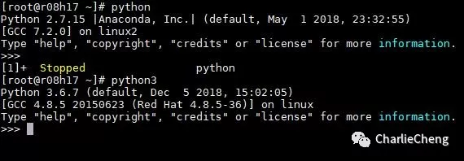

We can also add some plugins to our python environment.

I recommend to install virtualenv or anaconda beforehand. 

Virtualenv

```
sudo apt-get install virtualenv
```

or

```
sudo pip install virtualenv
```

Anaconda

```
conda create -n "name" python=3.6
```

Then for virtualenv users:

```
virtualenv venv
```

Anaconda users:

```
conda activate "the name"
```

virtualenv:

```
source my_project/venv/bin/activate
```

Then our environment is set up. We can install some plugins.

```
pip install tensorflow
pip install numpy
pip install pytz
pip install pandas
pip install "your plugins"
```

##### Your Linux and Python environment is set!


My personal Website: www.charliecheng.ga

Welcome to visit my website. I will update more articles in the future.


#### Thanks for patiently reading to the end.